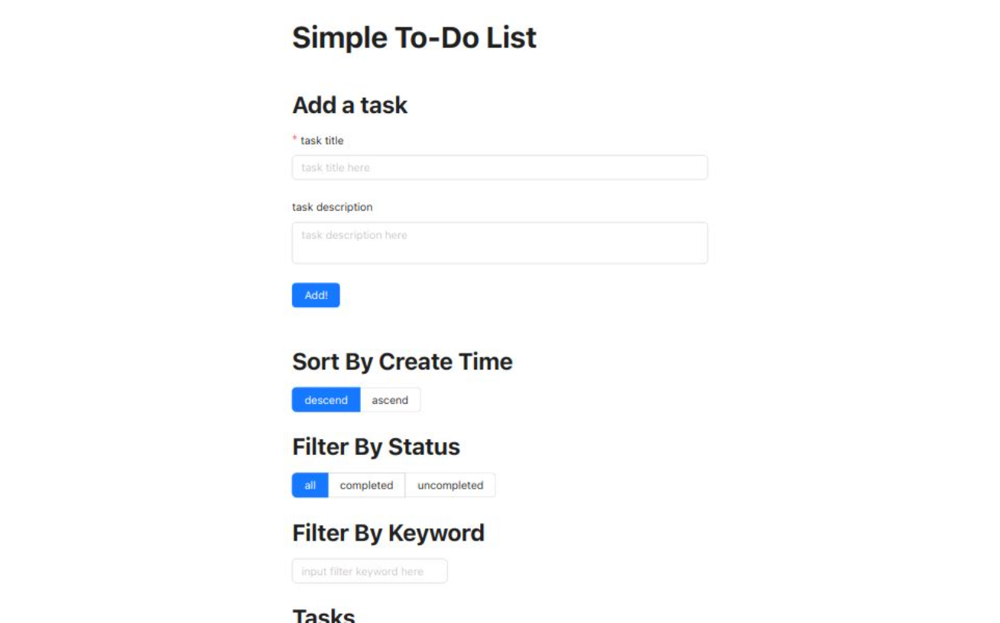

# Simple To-Do List

This project was created using [Create React App](https://create-react-app.dev/), and it utilizes Redux and [Redux Toolkit](https://redux-toolkit.js.org/) for state management. The UI framework used is [Ant Design](https://ant.design/) (though it's not extensively used). In the future, functionality will be added to store data using a backend database.

## Live Demo Site

[https://simple-todo-list-rfv690lnx-justin-hsus-projects-e6d5b75e.vercel.app/](https://simple-todo-list-rfv690lnx-justin-hsus-projects-e6d5b75e.vercel.app/)

## Available Scripts

In the project directory, you can run:

### `npm start`

Runs the app in the development mode.\
Open [http://localhost:3000](http://localhost:3000) to view it in your browser.

The page will reload when you make changes.\
You may also see any lint errors in the console.

### `npm run build`

Builds the app for production to the `build` folder.\
It correctly bundles React in production mode and optimizes the build for the best performance.

The build is minified and the filenames include the hashes.\
Your app is ready to be deployed!

See the section about [deployment](https://facebook.github.io/create-react-app/docs/deployment) for more information.

## Codebase Architecture

-   src/
    -   App.js
        -   The main component of the app. It contains the header, add task, sorting, filter, and tasks components.
    -   App.css
        -   CSS file for the app.
    -   constants.js
        -   Contains constants used throughout the app.
    -   index.css
        -   CSS file for the index page.
    -   index.js
        -   Sets up the Redux store and renders the App component.
    -   components/
        -   AddTask.js
            -   Component for adding a new task.
        -   Filter.js
            -   Component for filtering tasks based on type and keyword.
        -   Header.js
            -   Component for the header of the app.
        -   Sorting.js
            -   Component for sorting tasks based on type.
        -   Task.js
            -   Component for displaying a single task.
        -   Tasks.js
            -   Component for displaying a list of tasks.
    -   store/
        -   index.js
            -   Sets up the Redux store.
        -   slices/
            -   tasksSlices.js
                -   Slice for managing tasks state.
-   public/
    -   index.html
        -   Entry point for the index page.
